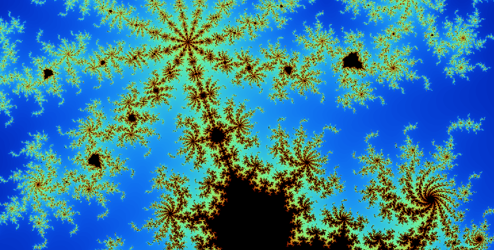
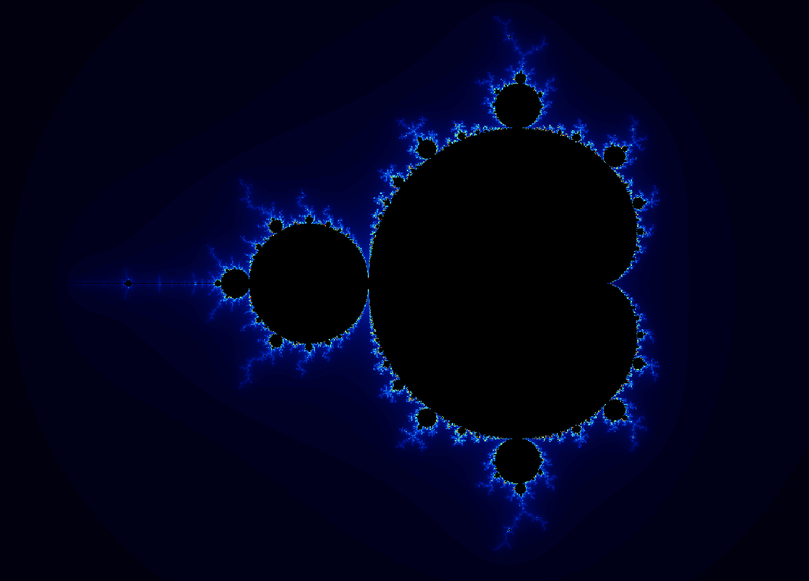
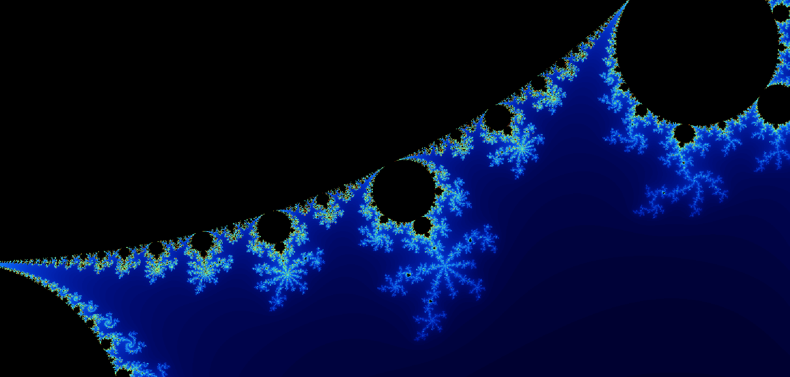
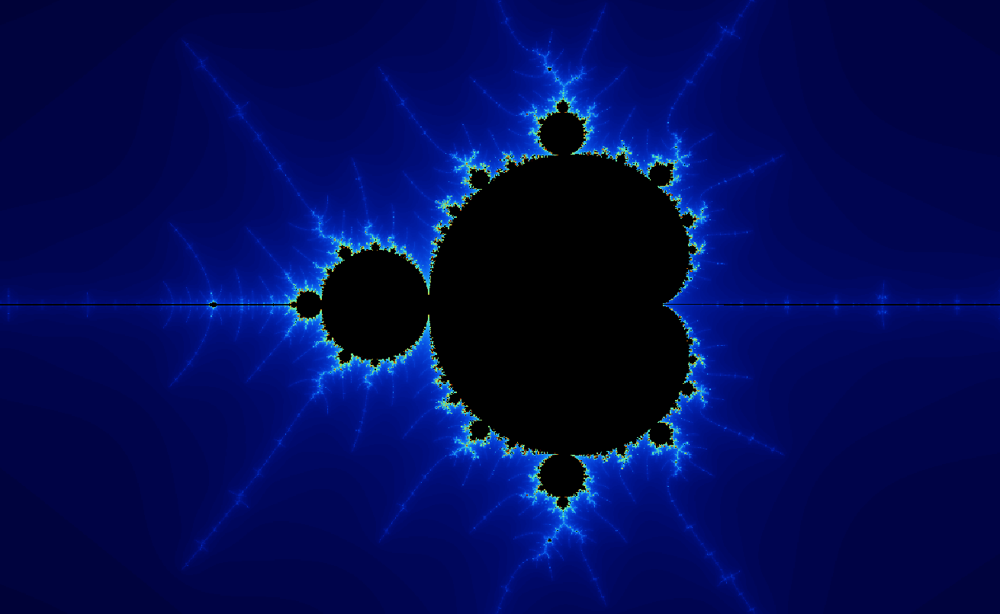
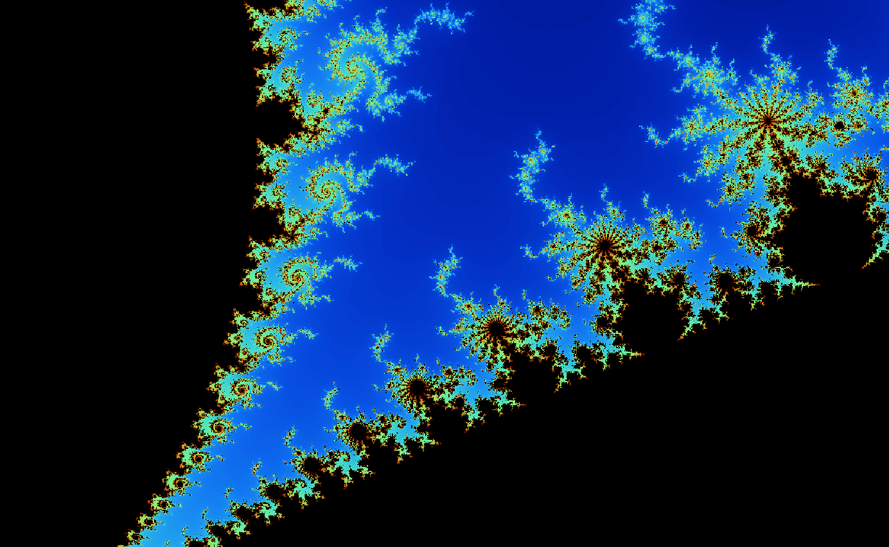
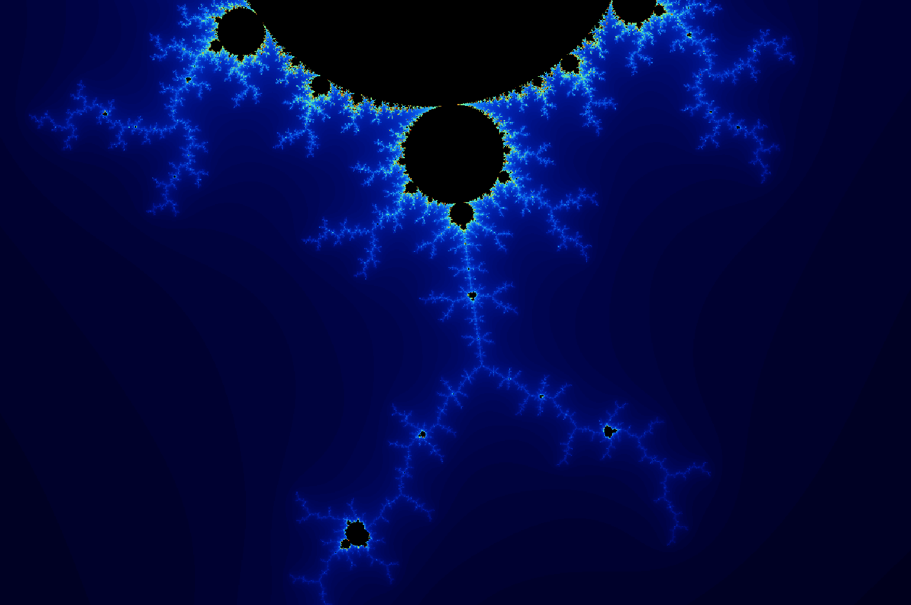

# Fractal Explorer


\
A fractal explorer written using the Java AWT for a showcase.

## Running it yourself

To run this project simply clone this repo:
```
git clone https://github.com/SergeantQuickscoper/fractal-explorer-awt 
```

Ensure you have a valid Java Development Kit (JDK V17+ recommended) and run one of the compilation and run scripts:

For Windows:
```
.\scripts\compileAndRun.ps1
```

For Linux, MacOS, other Unix-based systems with bash:
```
./scripts/compileAndRun.sh
```

You can also directly compile `ExplorerMain.java` with javac and run it that way too.

Have fun and feel free to open issues or contribute to the extended goals!

## Minimum goals before showcase (achieved)

- Be able to represent the Mandelbrot set.
- Zoom in while maintaining a good degree of accuracy.
- Be at least somewhat optimized considering the fractal math will be limited to the CPU.
- Gradient based on number of iters

(TODO: remove these next commit)

## Extended goals
- More fractals!!!
- Multithreading
- Animations!!
- UI to change parameters

## Mandelbrot Fractal Screenshot Showcase






\
Authored by: Don Roy Chacko <donisepic30@gmail.com>
